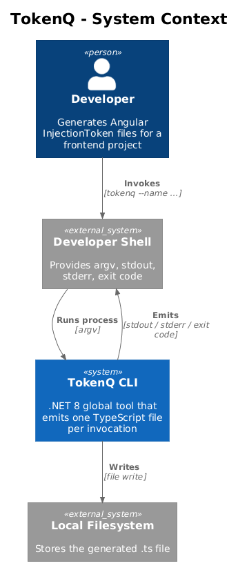
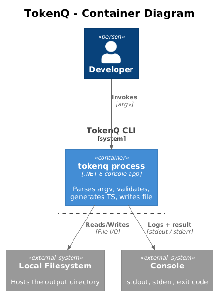

# TokenQ Detailed Designs — Index

TokenQ is a .NET 8 global tool that generates a single TypeScript source file
containing an empty `export interface` and a typed Angular `InjectionToken`
constant. It is small on purpose: one process, one job, no persistence, no
network. The designs below break the tool into vertical slices that each
deliver an observable behaviour and can be implemented with ATDD in a small
context.

## System Context



A developer invokes `tokenq` from a shell. The tool reads CLI options, writes a
file to the local filesystem, and emits log output to the console. There are no
network dependencies, no databases, and no other actors.

## Container View



The tool is a single self-contained .NET process. It depends only on the host
filesystem and the standard streams (stdout/stderr).

## Vertical Slice Map

The five slices below are ordered for ATDD. Each is independently testable and
each ends in something the user can observe. A later slice depends on the
classes introduced by an earlier slice but does not require any earlier slice
to be feature-complete in order to begin.

| #  | Feature | Status | What the user can observe after this slice | L2 IDs |
|----|---------|--------|---------------------------------------------|--------|
| 01 | [Generator Core](01-generator-core/README.md) | Complete | Calling `Generator.Render("IFooService")` returns the exact bytes that will be written to `foo-service.ts`. | L2-001, L2-002, L2-005, L2-007, L2-009, L2-015 |
| 02 | [CLI Shell](02-cli-shell/README.md) | Draft | `tokenq --name IFooService` parses arguments, calls the generator, prints content to stdout, and exits with the right code. | L2-003, L2-004 (option binding), L2-011, L2-016 |
| 03 | [File Output](03-file-output/README.md) | Draft | `tokenq --name IFooService --output ./svc` writes the file to disk safely with overwrite control. | L2-004 (write), L2-006, L2-008 |
| 04 | [Logging](04-logging/README.md) | Draft | Success and failure paths emit the right log levels to the right streams; `--verbose` reveals debug detail. | L2-010, L2-011 (verbose stack trace) |
| 05 | [Distribution](05-distribution/README.md) | Draft | `dotnet pack` produces a NuGet `.nupkg` that installs as a global tool and starts within the performance budget. | L2-012, L2-013, L2-014 |

## Whole-Tool Code Map

The complete tool is intentionally tiny. Five C# files, three of them under 50
lines:

```
src/TokenQ/
  TokenQ.csproj         // net8.0, PackAsTool, NuGet metadata        [slice 5]
  Program.cs            // composition root: DI + System.CommandLine [slice 2]
  Generator.cs          // pure: name -> (filename, content)         [slice 1]
  NameValidator.cs      // pure: validates TS identifier             [slice 1]
  FileWriter.cs         // safe write with overwrite + path checks   [slice 3]
```

Logging (slice 4) is configuration — it adds DI registrations and message calls
to the existing classes rather than introducing new ones.

## ATDD Convention

Every acceptance test file in `tests/TokenQ.Tests/` must carry a header
identifying the L2 requirement(s) it covers, e.g.:

```csharp
// Acceptance Test
// Traces to: L2-001, L2-002
// Description: Generated content contains interface and InjectionToken
```

This is enforced by convention only; reviewers should reject tests without it.
