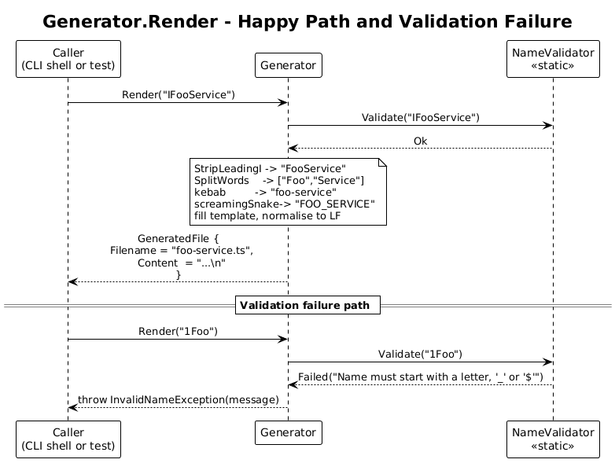

# 01 - Generator Core — Detailed Design

**Status:** Accepted

## 1. Overview

This slice produces, in memory, the exact bytes that will eventually be written
to disk. Given an interface name, the core returns a `GeneratedFile` value
containing the kebab-case filename and the full TypeScript source text.

Everything in this slice is pure: no file I/O, no console output, no DI
container required at runtime, no clock, no environment lookups. That is
deliberate — it is the foundation every later slice builds on, and it is
trivially unit-testable, which is exactly what L2-015 requires.

**In scope:** name validation, name transformations (kebab-case,
SCREAMING_SNAKE_CASE), TypeScript text rendering, deterministic line endings.

**Out of scope:** filesystem access, CLI parsing, logging, NuGet packaging.

**Traces to:** L2-001, L2-002, L2-005, L2-007, L2-009, L2-015.

## 2. Architecture

### 2.1 Class Diagram


### 2.2 Sequence — `Render`



`Generator.Render(name)` is a single function call. It validates, transforms,
and renders, returning a `GeneratedFile`. There are no side effects.

## 3. Component Details

### 3.1 `Generator`

- **Responsibility**: Produce a `GeneratedFile` from a raw interface name.
- **Type**: Concrete class, registered as a singleton in DI (per L2-015) so the
  CLI shell can resolve it without going through `System.CommandLine`.
- **Public surface**: `GeneratedFile Render(string interfaceName)`.
- **Behaviour**:
  1. Calls `NameValidator.Validate(interfaceName)`. On failure, throws
     `InvalidNameException` carrying the validator's message.
  2. Computes the **bare name** = `interfaceName` with one leading `I`
     stripped, but only when the next character is upper-case ASCII (so
     `IFoo` → `Foo`, but `Identity` stays as `Identity`).
  3. Computes the kebab-case **filename stem** from the bare name.
  4. Computes the SCREAMING_SNAKE_CASE **token name** from the bare name.
  5. Renders the file content from a single hard-coded template using the
     three computed strings.
  6. Returns `new GeneratedFile(filename: stem + ".ts", content: rendered)`.
- **Dependencies**: `NameValidator` (called as a static method, not injected).
- **Why a class, not a static method?** L2-015 requires DI registration. One
  class, one method — no interface, no abstraction.

### 3.2 `NameValidator`

- **Responsibility**: Decide whether a string is an acceptable interface name.
- **Type**: Static class with a single `Validate(string) → ValidationResult`
  method. No state, no DI registration — it is a pure helper.
- **Rules (all enforced; first failure wins, message identifies which)**:
  1. Not null, not empty, length 1–200.
  2. First character is `_`, `$`, or an ASCII letter.
  3. Every other character is `_`, `$`, an ASCII letter, or an ASCII digit.
  4. Not equal to any TypeScript reserved word — list is hard-coded inside
     the class as a `HashSet<string>`. The list covers strict-mode reserved
     words from the TypeScript handbook; non-reserved contextual keywords
     (`type`, `from`, etc.) are allowed.
- **Returns**: `ValidationResult` — either `Ok` or `Failed(message)`.
- **Why static?** It is a pure function. An interface here would be ceremony.
- **Why ASCII only?** Keeps validation a one-liner regex and matches every
  identifier the TypeScript users of the generated file will reasonably write.
  Unicode identifiers are valid TypeScript but explicitly out of scope here;
  this is documented in Open Questions.

### 3.3 Naming transformations

Both transformations operate on the **bare name** (the input with one leading
`I` already stripped if applicable). They are private helpers on `Generator`,
not separate classes.

- **kebab-case**: split the bare name at every transition from lower-case (or
  digit) to upper-case, lowercase each part, join with `-`.
  - `FooService` → `["Foo", "Service"]` → `foo-service`
  - `UserAccountManager` → `user-account-manager`
  - `Logger` → `logger`
- **SCREAMING_SNAKE_CASE**: same split, uppercase each part, join with `_`.
  - `FooService` → `FOO_SERVICE`
  - `UserAccountManager` → `USER_ACCOUNT_MANAGER`

A single splitter helper `SplitWords(string) → string[]` is called by both. It
is internal-visibility for unit testing.

### 3.4 Template

A single private `const string` field on `Generator` holds the template:

```text
import { InjectionToken } from '@angular/core';

export interface {INTERFACE} {
}

export const {TOKEN} = new InjectionToken<{INTERFACE}>('{TOKEN}');
```

Three substitutions, performed by `string.Replace`. No template engine,
no Razor, no Liquid. The result is normalised to `\n` line endings and
ends with a single `\n` (per L2-009).

## 4. Data Model

### 4.1 `GeneratedFile`

A C# `record`:

```csharp
public sealed record GeneratedFile(string Filename, string Content);
```

- `Filename` — bare filename including `.ts`, no directory component.
- `Content` — full file text, LF line endings, ending in a single `\n`.

### 4.2 `ValidationResult`

A C# discriminated record:

```csharp
public abstract record ValidationResult
{
    public sealed record Ok : ValidationResult;
    public sealed record Failed(string Message) : ValidationResult;
}
```

`InvalidNameException` is a simple `Exception` subclass thrown by `Generator`
when validation fails. The CLI shell (slice 02) maps it to exit code `1`.

## 5. Key Workflows

The only workflow is `Render`, shown in section 2.2. There is one happy path
and one failure path (validation fails → exception). Both are visible in the
class diagram.

## 6. ATDD Test Plan for This Slice

The slice can be implemented entirely with unit tests against `Generator`,
`NameValidator`, and the private splitter (made `internal` + `InternalsVisibleTo`).
No file system, no console, no host.

Tests to write first (in this order — the first failing test forces the next
piece of code):

1. `Render_IFooService_ProducesExpectedFilename` — covers L2-005 #1.
2. `Render_IFooService_ProducesExpectedContent` — covers L2-001 #1, L2-002 #1,
   L2-009 #3.
3. `Render_PreservesNameWithoutLeadingI` — covers L2-001 #2, L2-002 #3,
   L2-005 #3.
4. `Render_UserAccountManager_KebabAndScreamingForms` — covers L2-002 #2,
   L2-005 #2.
5. `Render_TwoCallsProduceIdenticalBytes` — covers L2-009 #1.
6. `Validate_RejectsLeadingDigit / Whitespace / ReservedWord / Empty / TooLong` —
   five separate tests, covers L2-007.
7. `Generator_CanBeResolvedFromServiceProvider` — covers L2-015 #1 (uses an
   `IServiceCollection.AddTransient<Generator>()` then resolves it).

Each test file carries a `// Traces to: L2-...` header.

## 7. Security Considerations

The generator only manipulates strings; it cannot reach the filesystem, the
network, or the environment from this slice. The single security obligation is
to refuse any name that the TypeScript compiler would refuse, so we do not
emit a file that breaks the consumer's build. That is handled by
`NameValidator`.

The template contains no user input inside string-quoting contexts that could
matter for code injection — the SCREAMING_SNAKE_CASE token name is the only
value rendered inside `'...'`, and validation already constrains it to
`[A-Za-z0-9_$]`.

## 8. Open Questions

- **Unicode identifiers.** TypeScript allows Unicode in identifiers; we do
  not. If a real user requests it, lift the regex to use the
  `\p{L}\p{Nl}\p{Mn}\p{Mc}\p{Nd}\p{Pc}` classes and add a reserved-word check
  against TypeScript's full keyword list. Until then, ASCII keeps the
  validator one line of regex.
- **All-caps interfaces (`IBM`, `IO`).** The leading-`I` stripper only triggers
  when the next character is an upper-case letter and there is at least one
  more character. `IO` becomes `O`, which is technically wrong if the user
  meant the literal name `IO`. Document the workaround: pass `IIO` or use a
  non-`I`-prefixed name. Not worth a flag until somebody asks.
- **Member generation.** The spec mandates an empty interface body. If
  generating members is requested later, the template grows; the rest of the
  pipeline is unaffected.
