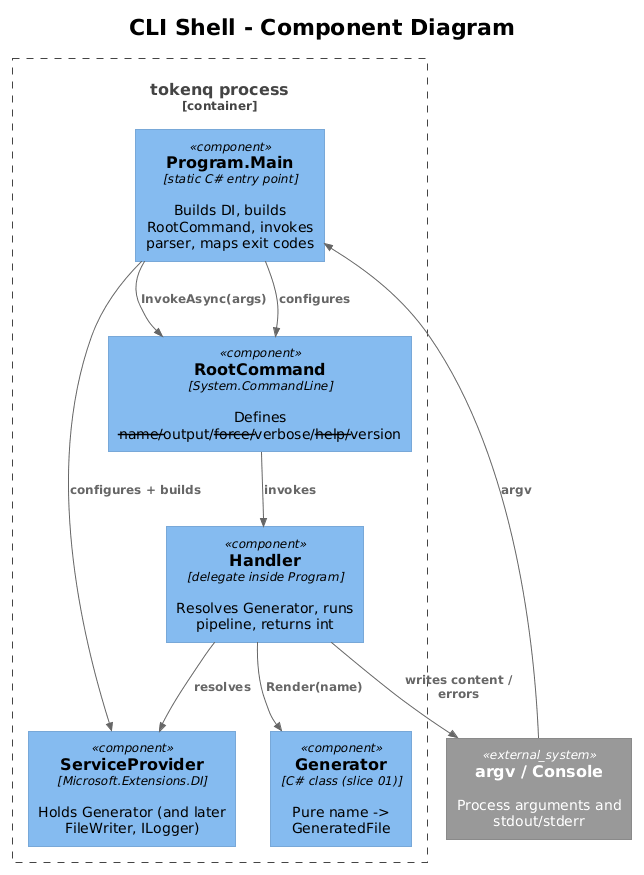
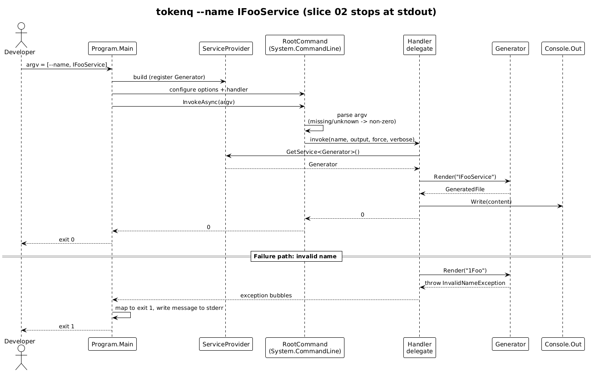

# 02 - CLI Shell — Detailed Design

## 1. Overview

This slice turns the pure generator from slice 01 into something a developer
can run from a terminal. It defines the `tokenq` command, parses argv, builds
a request object, and routes it through the pipeline. `--help` and `--version`
are handled by `System.CommandLine` itself; we only configure them.

After this slice, `tokenq --name IFooService` resolves the generator from DI,
prints the generated content to stdout, and exits with the right code. File
writing arrives in slice 03 — the shell deliberately stops at "render and
print" so this slice can be tested with no filesystem at all.

**In scope:** `System.CommandLine` setup, option binding, exit-code mapping,
DI composition root, help/version, redirecting generator output to stdout.

**Out of scope:** filesystem writes, log levels, NuGet packaging.

**Traces to:** L2-003, L2-004 (option binding only — actual file write is in
slice 03), L2-011, L2-016.

## 2. Architecture

### 2.1 Component View



There is a single composition root, `Program.Main`. It builds a
`ServiceCollection`, registers `Generator`, builds the root command, parses
argv, and either invokes the handler or returns a parser error.

### 2.2 Sequence — `tokenq --name IFooService`



## 3. Component Details

### 3.1 `Program`

- **Responsibility**: Compose the DI container, build the `RootCommand`,
  parse argv, return an exit code.
- **Type**: Static `class` with a single `Main(string[] args) → int` method
  and a private `BuildRootCommand(IServiceProvider) → RootCommand` helper.
- **Dependencies**:
  - `Microsoft.Extensions.DependencyInjection` for `ServiceCollection`.
  - `System.CommandLine` for parser + invocation.
  - `Generator` from slice 01 (resolved from the provider).
- **Behaviour**:
  1. Build a `ServiceCollection`. Register `Generator` as singleton.
     (Logging registration arrives in slice 04.)
  2. Build the root command (see 3.2).
  3. Call `rootCommand.InvokeAsync(args).GetAwaiter().GetResult()`.
  4. Return its result. `System.CommandLine` returns `0` on handler success
     and a non-zero code on parser errors. We override exit codes inside the
     handler when validation or generation fails (see section 4).

### 3.2 Root command definition

A single `RootCommand` named `tokenq` with the description
"Generate a TypeScript interface and Angular InjectionToken." Options:

| Option | Aliases | Type | Required | Default |
|--------|---------|------|----------|---------|
| `--name` | `-n` | `string` | yes | — |
| `--output` | `-o` | `string` | no | current working directory |
| `--force` | `-f` | `bool` | no | `false` |
| `--verbose` | `-v` | `bool` | no | `false` |

`--help` / `-h` and `--version` are added automatically by
`System.CommandLine`. The version string comes from
`AssemblyInformationalVersionAttribute`, which is populated by the
`<Version>` element in the csproj (slice 05).

The root command has a single async handler that accepts the four bound
values and an `IServiceProvider` (resolved through `BindingContext`).

### 3.3 Handler flow

The handler is the single place where slices 01, 03, and 04 meet. In slice
02 it stops at step 4:

1. Resolve `Generator` (and later `FileWriter`) from the provider.
2. `var generated = generator.Render(name);` — may throw
   `InvalidNameException`.
3. Resolve the absolute output directory:
   - If `--output` was supplied, treat it as relative-to-cwd if not already
     absolute, then `Path.GetFullPath` it.
   - If not supplied, use `Directory.GetCurrentDirectory()`.
4. **Slice 02 only**: write `generated.Content` to `Console.Out`. (Slice 03
   replaces this with `FileWriter.Write(...)`.)
5. Return `0`.

Exceptions raised inside the handler are mapped to exit codes by a single
`try/catch` wrapper in `Program.Main`:

| Exception type | Exit code | What user sees |
|----------------|-----------|----------------|
| `InvalidNameException` | `1` | message on stderr |
| `IOException` / `UnauthorizedAccessException` (slice 03) | `1` | message on stderr |
| `OperationCanceledException` | `130` | nothing |
| anything else | `2` | message on stderr; stack trace only if `--verbose` |

`System.CommandLine`'s parser already returns its own non-zero code when a
required option is missing or an unknown option is given, satisfying L2-003
#3 and L2-016 #3.

## 4. Data Model

No persisted entities. One in-process record:

```csharp
internal sealed record CommandRequest(
    string Name,
    string? Output,   // null => current working directory
    bool   Force,
    bool   Verbose);
```

`CommandRequest` is constructed inside the handler from the bound option
values; it is *not* a `System.CommandLine` binding target — keeping it
hand-built keeps the binding layer thin.

## 5. Key Workflows

### 5.1 Successful invocation

See sequence diagram in 2.2. Argv → parsed values → request → generator →
stdout → exit 0.

### 5.2 Missing `--name`

`System.CommandLine` writes its own error message ("Option '--name' is
required.") to stderr and returns its non-zero code. We do not need our own
handling.

### 5.3 `--help` / `--version`

`System.CommandLine` handles both. The handler is not invoked. We only need
to verify in tests that the help text lists every option, which it does
automatically once the options are added to the root command.

## 6. CLI Contract

The full grammar is:

```
tokenq --name <interface-name>
       [--output <directory>]
       [--force]
       [--verbose]
       [--help | --version]
```

Examples:

```
tokenq --name IUserService
tokenq -n IUserService -o ./src/app/services
tokenq --name Logger --force --verbose
```

Exit codes (L2-011): `0` success, `1` user/input error, `2` unexpected internal
error.

## 7. ATDD Test Plan for This Slice

Tests live in `tests/TokenQ.Tests/` and exercise `Program.Main(string[])`
directly. No subprocess spawning. Every test redirects `Console.Out` and
`Console.Error` to in-memory `StringWriter`s.

1. `Main_WithValidName_PrintsGeneratedContentAndReturnsZero` — covers L2-003
   #1, L2-011 #1.
2. `Main_WithShortNameAlias_PrintsGeneratedContent` — covers L2-003 #2.
3. `Main_WithoutName_ReturnsNonZeroAndWritesParserErrorToStderr` — covers
   L2-003 #3, L2-016 #3.
4. `Main_WithHelpFlag_ListsAllOptionsAndReturnsZero` — covers L2-003 #4,
   L2-016 #1.
5. `Main_WithVersionFlag_PrintsVersionAndReturnsZero` — covers L2-016 #2.
6. `Main_WithInvalidName_ReturnsOneAndWritesErrorToStderr` — covers L2-007
   (integration), L2-011 #2.
7. `Main_HandlerThrowsUnexpectedException_ReturnsTwoNoStackTrace` — covers
   L2-011 #3.

Each test file carries the `// Traces to: L2-...` comment header.

## 8. Security Considerations

`System.CommandLine` is the only thing that touches argv. It does not
interpret values as code, does not invoke external processes, and does not
read environment variables on our behalf. Argument parsing is therefore not
a meaningful attack surface here. The output stream redirection in the
handler is straight `Console.Out.Write` — no string formatting templates,
so format-string vulnerabilities are not possible.

## 9. Open Questions

- **Async vs sync `Main`.** `System.CommandLine` natively returns `Task<int>`.
  Using `static int Main` and `.GetAwaiter().GetResult()` is enough — we have
  no real async work. Switch to `static async Task<int> Main` only if a future
  feature performs network I/O.
- **Subcommands.** For now there is only the root command. If we ever add
  `tokenq scan`, `tokenq install`, etc., this slice's design is the place to
  introduce a `Command` per subcommand. Until then, a single `RootCommand` is
  the simplest thing.
- **Bind-from-record helpers.** `System.CommandLine` has options that auto-bind
  to a record. Building the request by hand inside the handler is currently
  shorter and clearer; revisit if the option list grows past about eight.
