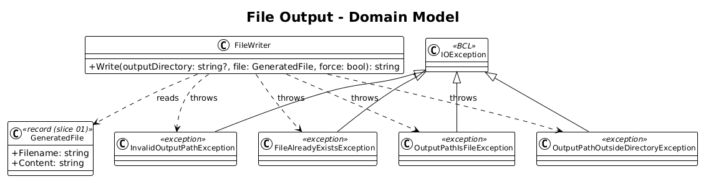
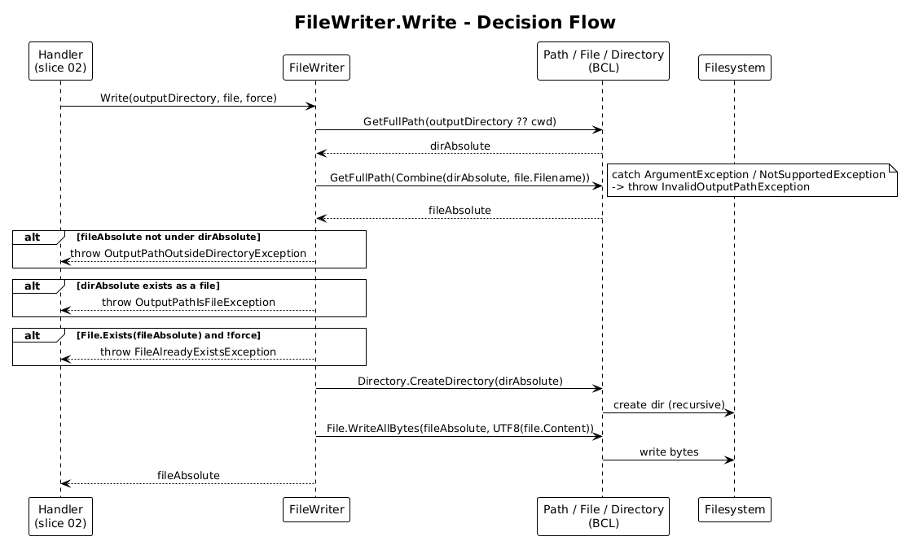

# 03 - File Output — Detailed Design

**Status:** Complete

## 1. Overview

This slice replaces the "write content to stdout" step in slice 02 with a real
filesystem write. Given a `GeneratedFile` and a target directory, write the
file safely: create the directory if it does not exist, refuse to overwrite
unless `--force` is set, refuse to write outside the resolved output directory,
and refuse paths that the OS itself rejects.

The slice is small on purpose. Path resolution happens once, up front. The
write itself is one `File.WriteAllText` call with explicit UTF-8 (no BOM) and
LF line endings preserved from `GeneratedFile.Content`.

**In scope:** path resolution, directory creation, overwrite policy, traversal
prevention, OS-level path validation.

**Out of scope:** content rendering (slice 01), CLI argument parsing
(slice 02), logging (slice 04).

**Traces to:** L2-004 (write side), L2-006, L2-008.

## 2. Architecture

### 2.1 Class Diagram



### 2.2 Sequence — `Write`



## 3. Component Details

### 3.1 `FileWriter`

- **Responsibility**: Persist a `GeneratedFile` to a directory, applying the
  overwrite policy and the safety checks.
- **Type**: Concrete class registered as singleton in DI. Made instantiable
  (rather than static) so tests in slice 04 can verify `ILogger` calls; the
  class itself has no state.
- **Public surface**:
  ```csharp
  public sealed class FileWriter
  {
      public string Write(string outputDirectory, GeneratedFile file, bool force);
  }
  ```
  Returns the absolute path of the written file (used by the success log
  message in slice 04).
- **Behaviour** (in order; first failure throws):
  1. **Resolve the directory.**
     - If `outputDirectory` is `null`/empty, use `Directory.GetCurrentDirectory()`.
     - Else `Path.GetFullPath(outputDirectory)` against the cwd.
     - Capture the resolved value as `dirAbsolute`.
  2. **Resolve the file path.**
     - `Path.GetFullPath(Path.Combine(dirAbsolute, file.Filename))` →
       `fileAbsolute`.
  3. **Containment check (L2-008 #1).**
     - Verify `fileAbsolute` starts with `dirAbsolute + Path.DirectorySeparatorChar`
       (case-insensitive compare on Windows). If not → throw
       `OutputPathOutsideDirectoryException`.
  4. **Path-character check (L2-008 #3).**
     - Wrap step 2 in `try/catch (ArgumentException | NotSupportedException)`.
       On catch → throw `InvalidOutputPathException`.
  5. **Existing-file collision (L2-006).**
     - If `File.Exists(fileAbsolute)` is true and `force` is false → throw
       `FileAlreadyExistsException(fileAbsolute)`.
     - If true and `force` is true → fall through to step 7 (overwrite).
     - If false → fall through to step 6.
  6. **Existing-non-directory at the directory path (L2-004 #4).**
     - If `dirAbsolute` exists as a file (not a directory) → throw
       `OutputPathIsFileException`. Detected with
       `File.Exists(dirAbsolute) && !Directory.Exists(dirAbsolute)`.
  7. **Ensure directory.**
     - `Directory.CreateDirectory(dirAbsolute)` — no-op if it already exists,
       creates intermediate directories otherwise (L2-004 #3).
  8. **Write.**
     - `File.WriteAllBytes(fileAbsolute, Encoding.UTF8.GetBytes(file.Content))`.
       Using `WriteAllBytes` plus explicit UTF-8 (without BOM) preserves the
       LF line endings established by slice 01 byte-for-byte (L2-009).
  9. Return `fileAbsolute`.

- **Why one method, no interface?** There is exactly one implementation. An
  interface would be ceremony; the slice's tests use a temp directory.
- **Why `Path.GetFullPath` instead of manual `..` filtering?** It is the
  canonical way the BCL resolves traversal sequences. Comparing prefixes after
  resolution is the smallest reliable containment check.

### 3.2 Exception types

All thrown by `FileWriter`, all derive from `IOException` so the CLI shell's
existing `IOException → exit 1` mapping (slice 02) covers them automatically:

```csharp
public sealed class FileAlreadyExistsException(string path)
    : IOException($"File already exists: {path}. Use --force to overwrite.");

public sealed class OutputPathOutsideDirectoryException(string path)
    : IOException($"Resolved file path escapes output directory: {path}");

public sealed class OutputPathIsFileException(string path)
    : IOException($"Output path exists but is a file, not a directory: {path}");

public sealed class InvalidOutputPathException(string path, Exception inner)
    : IOException($"Output path is not valid for this operating system: {path}", inner);
```

`UnauthorizedAccessException` (L2-008 #2) is not wrapped — `Directory.CreateDirectory`
or `File.WriteAllBytes` throws it directly. The CLI shell's existing handler
catches it and maps it to exit 1 with the standard message; slice 04 redacts
sensitive details.

## 4. Data Model

No new entities. `GeneratedFile` is the value coming in from slice 01.

## 5. Key Workflows

### 5.1 First-time write to default directory

`tokenq --name IFooService` → handler builds an empty `outputDirectory` →
`FileWriter.Write(null, file, force: false)` → directory is the cwd, file does
not exist → write succeeds → handler logs the absolute path.

### 5.2 Overwrite

`tokenq --name IFooService --output ./svc --force` → resolve directory →
file exists → `force == true` → fall through → write succeeds.

### 5.3 Refusal

Same command without `--force` → file exists → throw
`FileAlreadyExistsException` → bubbles to `Program.Main` → exit 1, message on
stderr.

### 5.4 Nested directory creation

`tokenq --name IFooService --output ./a/b/c` and `./a` does not exist →
`Path.GetFullPath` succeeds → containment OK → directory does not exist as a
file → `Directory.CreateDirectory` creates `./a/b/c` recursively → write.

### 5.5 Traversal attempt

`tokenq --name IFooService --output ../../../etc` → `Path.GetFullPath` returns
some absolute path → the resolved file path is checked against the resolved
directory. The two will match (because both resolved through the same
`Path.GetFullPath` call), so containment passes — the user is writing where
they asked to write. The check exists to defend against a future scenario
where the directory and the filename are constructed separately and the
filename contains `..` or absolute components. We resist that today by passing
the filename through `Path.GetFullPath` *combined* with the directory, then
comparing prefixes; if the filename is ever sourced from an untrusted place
the check is already in place.

## 6. ATDD Test Plan for This Slice

Tests use `Path.GetTempPath()` + `Guid.NewGuid()` for isolation; each test
cleans up its directory in a finally block.

1. `Write_NewFileInExistingDir_WritesContent` — covers L2-004 #2.
2. `Write_NoOutput_UsesCurrentWorkingDirectory` — covers L2-004 #1 (sets cwd
   to the temp dir for the duration of the test).
3. `Write_NestedNonexistentDir_CreatesParents` — covers L2-004 #3.
4. `Write_DirectoryPathIsExistingFile_Throws` — covers L2-004 #4.
5. `Write_ExistingFileWithoutForce_Throws_NotModified` — covers L2-006 #1.
6. `Write_ExistingFileWithForce_Replaces` — covers L2-006 #2.
7. `Write_NonExistingFileWithForce_Writes` — covers L2-006 #3.
8. `Write_TraversalSegmentsResolvedAndContained` — covers L2-008 #1.
9. `Write_PathWithIllegalChars_Throws` — covers L2-008 #3.
10. `Write_DirectoryNotWritable_PropagatesUnauthorizedAccess` — covers
    L2-008 #2 (uses a directory whose ACL denies write on Windows; `[Fact(Skip="...")]`
    on POSIX where reproducing is awkward).
11. `Write_BytesIdenticalAcrossInvocations` — covers L2-009 #1, hashes the
    written file to confirm UTF-8 + LF round-trip.

Each test file carries the `// Traces to: L2-...` header.

## 7. Security Considerations

- **Path traversal.** Defended by `Path.GetFullPath` resolution + containment
  prefix check. We do not parse `..` segments by hand.
- **Permission errors.** `UnauthorizedAccessException` is allowed to surface
  with its standard `.Message`. The error path in slice 04 deliberately logs
  only the directory we attempted to write to and the OS message — never
  `ex.ToString()` (which would include a stack trace) and never any
  environment variables. This addresses L2-008 #2's "no sensitive details"
  clause.
- **Encoding.** Always UTF-8 without a BOM. Using a BOM would silently change
  the SHA-256 of the output and break L2-009.
- **TOCTOU.** The collision check (`File.Exists`) and the write are not
  atomic. A race between check and write is possible but uninteresting for a
  developer tool; if it ever matters, switch to `File.Open` with
  `FileMode.CreateNew` (throws `IOException` if the file exists) and let the
  exception drive the user message.

## 8. Open Questions

- **Atomic writes via temp + rename.** Not needed today: the file is small,
  and a partial write is recoverable by re-running. Add only if a real user
  report shows half-written files in the wild.
- **Symbolic-link policy.** We do not detect or refuse symlinks. If the
  resolved directory is a symlink that points outside the user's project,
  that is the user's choice. Revisit only if the tool is ever reused in an
  untrusted multi-tenant context, which is not in scope.
- **Cross-platform case sensitivity.** The containment prefix check uses
  `StringComparison.OrdinalIgnoreCase` on Windows and `Ordinal` elsewhere.
  This is a four-line static helper; keep it inline rather than introducing a
  `PathComparer` abstraction.
