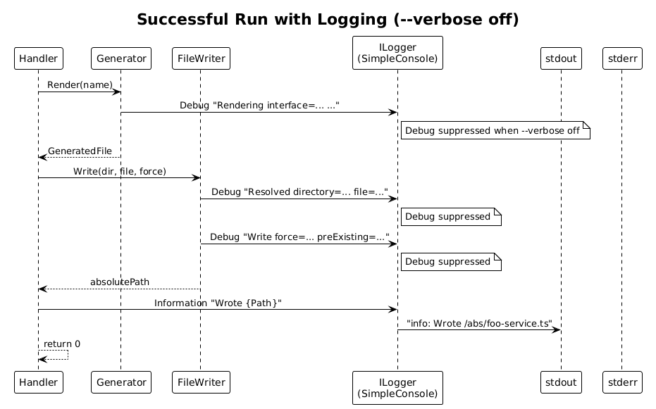
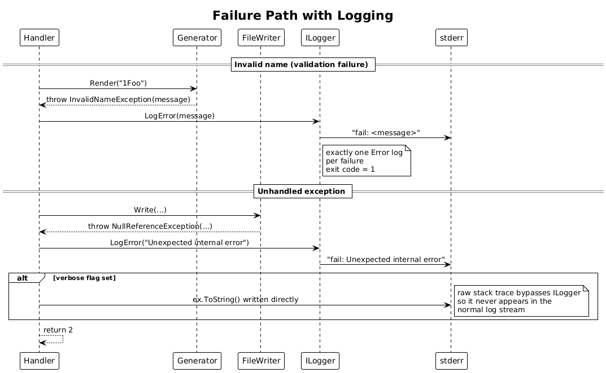

# 04 - Logging — Detailed Design

**Status:** Complete

## 1. Overview

This slice adds `Microsoft.Extensions.Logging` to the existing classes. No new
domain types — the work is configuration in `Program` and a handful of
`ILogger.LogX(...)` calls in `Generator`, `FileWriter`, and the handler.

The console logger is configured to send `Information` and below to stdout and
`Warning` and above to stderr. The `--verbose` flag flips the minimum level
from `Information` to `Debug`. Failure paths emit exactly one `Error` message
and translate the inner exception's message into something user-facing
(without leaking stack traces unless `--verbose` is set).

**In scope:** logger registration, log-level filtering by `--verbose`, error
stream routing, message redaction (no environment variables, no file body).

**Out of scope:** new business logic, performance metrics, structured log
backends.

**Traces to:** L2-010, L2-011 (the verbose-stack-trace clause).

## 2. Architecture

### 2.1 Sequence — Successful Run with Logging



### 2.2 Sequence — Failure with Logging



## 3. Component Details

### 3.1 Logging composition in `Program`

`Program.Main` adds logging to the `ServiceCollection` *after* it knows
whether `--verbose` was supplied. Because parsing happens before composition
in `System.CommandLine`'s normal flow, we do the lookup with a tiny
preliminary pass:

1. Pre-parse argv with the same `RootCommand` to learn whether `--verbose`
   is present. (Cheap: `RootCommand.Parse(args).GetValueForOption(verbose)`.)
2. Build the `ServiceCollection` and call:
   ```csharp
   services.AddLogging(b =>
   {
       b.AddSimpleConsole(o =>
       {
           o.SingleLine    = true;
           o.IncludeScopes = false;
           o.TimestampFormat = null; // deterministic output
       });
       b.SetMinimumLevel(verbose ? LogLevel.Debug : LogLevel.Information);
       b.AddFilter("Microsoft", LogLevel.Warning);
   });
   ```
3. The default `SimpleConsole` writes everything to stdout. To send `Warning`
   and above to stderr (per L2-010 #3), register a small custom
   `ConsoleFormatter` is overkill. Instead: register *two* console providers
   with different filters — one configured with `LogToStandardErrorThreshold =
   LogLevel.Warning`. That option is built into
   `Microsoft.Extensions.Logging.Console` and is the smallest possible way to
   meet the requirement:
   ```csharp
   b.AddSimpleConsole(o => o.SingleLine = true);
   services.Configure<ConsoleLoggerOptions>(o =>
       o.LogToStandardErrorThreshold = LogLevel.Warning);
   ```

### 3.2 Logger usage by class

The categories follow the class names (the BCL convention).

| Class | Level | Message (templated) |
|-------|-------|---------------------|
| `Generator` | `Debug` | `"Rendering interface={Interface} bare={Bare} kebab={Kebab} screaming={Screaming}"` |
| `FileWriter` | `Debug` | `"Resolved directory={Dir} file={File}"` |
| `FileWriter` | `Debug` | `"Write force={Force} preExisting={Existed}"` |
| Handler | `Information` | `"Wrote {Path}"` (single source of the success message — L2-010 #1) |
| Handler | `Error` | `"{Reason}"` — see redaction below |

**Redaction rule (L2-010 #4):** the handler builds the error message using
only the exception's `.Message`. It never logs `ex.ToString()` (which would
include a stack trace) and never logs the rendered file content. If
`--verbose` is set, the handler additionally writes `ex.ToString()` directly
to `Console.Error` *outside* the logging pipeline — this is what produces a
stack trace for the verbose case in L2-011 #3 without leaking it through the
normal error log.

### 3.3 No logging in `NameValidator`

`NameValidator` returns a `ValidationResult`. Logging the failure happens
once in the handler at `Error` level. This keeps the validator pure and
respects "exactly one Error message per failure" (L2-010 #3).

## 4. Data Model

None.

## 5. Workflow Notes

The two sequence diagrams in section 2 cover the visible behaviour. The only
non-obvious detail is the dual-stream handling: identical `ILogger` calls
land on stdout or stderr based on level, driven entirely by
`LogToStandardErrorThreshold`. We do not maintain two loggers in client code.

## 6. ATDD Test Plan for This Slice

Tests inject an in-memory logger by replacing the console provider with a
test-only one (`List<(LogLevel, string, string)>`). The handler is invoked
through `Program.Main` with `Console.Out` / `Console.Error` redirected to
`StringWriter` so stream routing can be asserted directly.

1. `Run_Success_WritesInfoToStdoutNamingFile_NoDebug` — covers L2-010 #1.
2. `Run_Verbose_EmitsDebugForParsingAndPathAndWrite` — covers L2-010 #2
   (asserts at least one `Debug` from each of parsing, path resolution, and
   write).
3. `Run_InvalidName_EmitsExactlyOneErrorToStderr` — covers L2-010 #3.
4. `Run_FileCollisionWithoutForce_EmitsExactlyOneErrorToStderr` — covers
   L2-010 #3.
5. `Run_AnyFailure_NeverLogsFileContentOrEnvVars` — covers L2-010 #4 (asserts
   that no captured log message contains the file body or the value of any
   environment variable currently set in the test process).
6. `Run_UnhandledException_NoStackInLogger_StackInStderrOnlyWhenVerbose` —
   covers L2-011 #3.

Each test file carries the `// Traces to: L2-...` header.

## 7. Security Considerations

The redaction rule above is the security-relevant control. The risk is
information disclosure through diagnostic output: stack traces can leak
deployment paths, exception types can hint at internal structure, and
generated file content can contain copyrighted template fragments. The
mitigations in section 3.2 keep all of this out of the normal log stream and
gate stack traces behind `--verbose`.

## 8. Open Questions

- **Structured logging back end.** Today everything goes to the console.
  Adding a JSON formatter is a one-liner if anyone asks; until then
  `SimpleConsole` keeps output developer-friendly.
- **Locale.** Messages are English-only. Localisation costs a resource file
  per language and a `Resources.resx`; not worth it for a developer tool.
- **OpenTelemetry / metrics.** Out of scope. Performance is asserted via the
  acceptance test in slice 05, not via emitted metrics.
