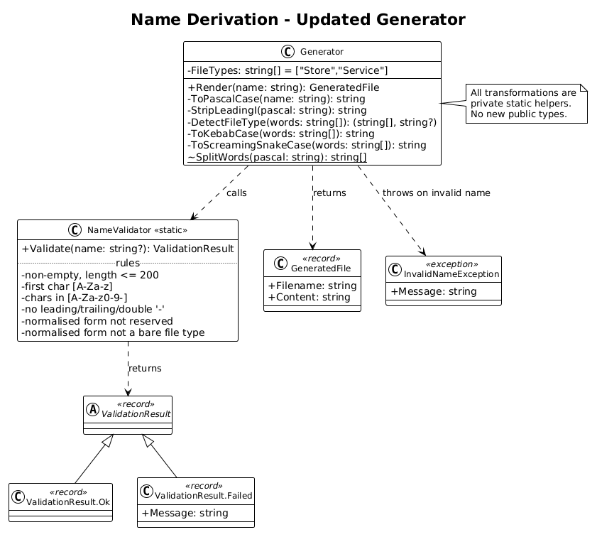
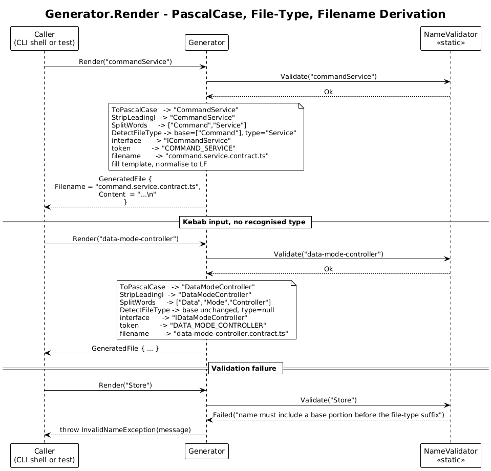

# 06 - Name Derivation — Detailed Design

**Status:** Complete

## 1. Overview

This slice refines the Generator Core (slice 01) so that a single user-supplied
name — given in PascalCase, camelCase, or kebab-case — drives three derived
strings:

- the **interface name** (always prefixed `I`),
- the **InjectionToken constant name and string** (SCREAMING_SNAKE_CASE),
- the **output filename** (kebab-case, with a recognised file-type suffix
  promoted to a dotted segment, ending in `.contract.ts`).

The change is mechanical, not architectural. Slice 01 already has a `Generator`
class and a `NameValidator`. This slice extends them. **No new classes, no new
interfaces, no new abstractions.**

**In scope:**
- A normalisation step that turns any of the three accepted input forms into
  PascalCase (L2-018).
- A closed `Store` / `Service` file-type table that the filename builder
  consults (L2-017).
- Updated interface-name rule: prepend `I` unless already in `I<Pascal>` form
  (L2-001).
- Updated filename rule: `<base>.<type>.contract.ts` or `<full>.contract.ts`
  (L2-005).
- Relaxed validation: accept ASCII letters, digits, and the kebab separator
  `-` only; reject leading/trailing/consecutive `-`; reject reserved words on
  the *normalised* PascalCase form (L2-007).

**Out of scope:**
- CLI plumbing, file I/O, logging, packaging — those slices (02–05) consume
  this slice unchanged.
- Adding new file types beyond `Store` and `Service` — explicitly closed by
  L2-017 #4. New types require a requirement update and a single-line code
  change.

**Traces to:** L2-001, L2-002, L2-005, L2-007, L2-015, L2-017, L2-018.

**Supersedes** the corresponding sections of slice 01: tests written against
the old shape (e.g. `Render("IFooService") -> "foo-service.ts"`) need to be
updated to the new contract before this slice can be marked Complete.

## 2. Architecture

### 2.1 Class Diagram



### 2.2 Sequence — `Render`



`Generator.Render(name)` remains a single function call. It validates,
normalises, derives, and renders, returning a `GeneratedFile`. There are no
side effects.

## 3. Component Details

### 3.1 `Generator` (extended)

The class keeps its public surface:

```csharp
public GeneratedFile Render(string name);
```

What changes is the body. The pipeline is now:

1. `NameValidator.Validate(name)` — throw `InvalidNameException` on failure.
2. `pascal = ToPascalCase(name)` — see §3.3.
3. `bare = StripLeadingI(pascal)` — unchanged from slice 01: strip a leading
   `I` only when the next character is upper-case ASCII.
4. `words = SplitWords(bare)` — unchanged from slice 01: split at every
   transition from `[a-z0-9]` to `[A-Z]`.
5. `(baseWords, fileType) = DetectFileType(words)` — see §3.4.
6. **Interface name** = pascal already starts with `I<Upper>` ? `pascal` :
   `"I" + pascal`. This satisfies L2-001 #4 without re-running normalisation.
7. **Token** = SCREAMING_SNAKE of `words` (the bare PascalCase split).
8. **Filename** =
   - `fileType is null` → `kebab(words) + ".contract.ts"`
   - else → `kebab(baseWords) + "." + fileType.ToLowerInvariant() + ".contract.ts"`
9. Render the template (unchanged) using `interface` and `token`. Return
   `new GeneratedFile(filename, content)`.

All transformations are private static methods on `Generator`. The only one
exposed `internal` for direct unit testing is `SplitWords`, as today.

**Why keep everything in one class?** The whole pipeline is ~50 lines of
string manipulation. Extracting a `NameNormaliser`, `FileTypeDetector`, or
`FilenameBuilder` would create three classes that each have one caller and
zero alternative implementations — pure ceremony. If a second consumer ever
appears, extract then.

### 3.2 `NameValidator` (rules updated)

The static class and its `Validate(string?) → ValidationResult` signature
are unchanged. The rule set changes:

| Rule | Behaviour |
|------|-----------|
| Empty / null | reject with `"name must not be empty"` |
| Length > 200 | reject with `"name must be 200 characters or fewer"` |
| First char not `[A-Za-z]` | reject (`"name must begin with an ASCII letter"`) |
| Any char outside `[A-Za-z0-9-]` | reject (`"only ASCII letters, digits, and '-' are permitted"`) |
| Leading or trailing `-` | reject |
| Two or more consecutive `-` | reject |
| Normalised PascalCase form is a TS reserved word | reject |
| Normalised PascalCase form equals a recognised file type alone (e.g. `Store`) | reject (L2-017 #5) |

The reserved-word table stays the same hard-coded `HashSet<string>` from
slice 01. Comparison happens against the *PascalCase* form, since
`interface` is identical to its PascalCase form (`Interface`) → no, `interface`
PascalCases to `Interface`, which is not a reserved word. So the check must
run against the normalised form **and** the original input. To keep this
simple: validate the original input against the reserved table after
lower-casing it. That mirrors the user's intent ("don't let me name this
`interface`") and stays one line.

The two file-type-only checks (file-type word alone, reserved-word collision)
are placed in `NameValidator` rather than in `Generator` so all rejections
happen before any derivation runs and the error path is the same exception
type users already see.

**Why not a richer validation result with structured error codes?** No
caller in this codebase, today or in the requirements, branches on validation
error categories. A single string message is enough.

### 3.3 `ToPascalCase` — normalisation

A private static helper inside `Generator`. Two cases, decided by whether the
input contains `-`:

- **No `-`:** the input is already PascalCase or camelCase. Uppercase the
  first character, leave the rest alone:
  - `EventStore` → `EventStore`
  - `commandService` → `CommandService`
  - `IFooService` → `IFooService`
- **Has `-`:** split on `-`; for each segment, uppercase the first char and
  lowercase the rest; concatenate:
  - `data-mode-controller` → `DataModeController`
  - `Data-Mode-Controller` → `DataModeController`

Validation has already rejected empty segments (leading/trailing/consecutive
`-`), so the splitter is straightforward.

**Determinism (L2-009, L2-018 #4):** `char.ToUpperInvariant` /
`ToLowerInvariant` are used everywhere. No `CurrentCulture` paths.

### 3.4 `DetectFileType` — recognised suffixes

```csharp
private static readonly string[] FileTypes = ["Store", "Service"];
```

A single `static readonly string[]` lives at the top of `Generator`. The
detector takes the bare PascalCase word array (output of `SplitWords`) and
returns either:

- `(words, null)` if the trailing word is not in the table, or
- `(words[..^1], words[^1])` if it matches.

Match is case-sensitive (`Store`, not `store` or `STORE`); the only path that
produces these words is `SplitWords` over a PascalCase string, which always
emits each word with a single leading capital, so case-sensitivity is not a
behavioural difference but it is a cheaper check.

The "name is just a file-type word" guard (L2-017 #5) is enforced earlier by
`NameValidator`, so by the time `DetectFileType` runs, `words.Length >= 2`
whenever the trailing word matches.

**Why an array, not a `HashSet`, not an enum?** Two values, fixed at build
time, looked up zero-or-one times per invocation. An array `Contains` is
fastest and most readable.

### 3.5 Template

Unchanged from slice 01 — the only substitutions are `{INTERFACE}` and
`{TOKEN}`, and both are produced from the new pipeline:

```text
import { InjectionToken } from '@angular/core';

export interface {INTERFACE} {
}

export const {TOKEN} = new InjectionToken<{INTERFACE}>('{TOKEN}');
```

LF line endings, single trailing `\n`, deterministic byte-for-byte (L2-009).

## 4. Data Model

`GeneratedFile`, `ValidationResult` (`Ok` / `Failed`), and
`InvalidNameException` are unchanged from slice 01. No new types are
introduced.

## 5. Worked Examples

| Input | PascalCase | Bare | Words | File type | Interface | Token | Filename |
|-------|-----------|------|-------|-----------|-----------|-------|----------|
| `EventStore` | `EventStore` | `EventStore` | `[Event, Store]` | `Store` | `IEventStore` | `EVENT_STORE` | `event.store.contract.ts` |
| `commandService` | `CommandService` | `CommandService` | `[Command, Service]` | `Service` | `ICommandService` | `COMMAND_SERVICE` | `command.service.contract.ts` |
| `data-mode-controller` | `DataModeController` | `DataModeController` | `[Data, Mode, Controller]` | *(none)* | `IDataModeController` | `DATA_MODE_CONTROLLER` | `data-mode-controller.contract.ts` |
| `IUserAccountManager` | `IUserAccountManager` | `UserAccountManager` | `[User, Account, Manager]` | *(none)* | `IUserAccountManager` | `USER_ACCOUNT_MANAGER` | `user-account-manager.contract.ts` |
| `Logger` | `Logger` | `Logger` | `[Logger]` | *(none)* | `ILogger` | `LOGGER` | `logger.contract.ts` |
| `Store` | `Store` | `Store` | `[Store]` | — | rejected by validator (L2-017 #5) |  |  |

## 6. ATDD Test Plan for This Slice

All tests are unit tests against `Generator` and `NameValidator`. No file I/O,
no host. Each test file carries a `// Traces to: L2-...` header.

New / updated tests (each name is a `[Fact]`):

1. `Render_EventStore_DerivesIPrefixedInterfaceAndStoreFilename` —
   L2-001 #1, L2-002 #1, L2-005 #1, L2-017 #1, L2-018 #1.
2. `Render_CommandService_NormalisesCamelCaseAndPromotesServiceSegment` —
   L2-001 #2, L2-002 #2, L2-005 #2, L2-017 #2, L2-018 #2.
3. `Render_DataModeController_NormalisesKebabAndOmitsTypeSegment` —
   L2-001 #3, L2-002 #3, L2-005 #3, L2-017 #3, L2-018 #3.
4. `Render_AlreadyIPrefixed_DoesNotDoubleI` — L2-001 #4, L2-005 #5.
5. `Render_UnrecognisedTrailingWord_UsesFlatContractFilename` — L2-005 #4
   (covers `UserAccountManager`, `FooController`, `Logger`).
6. `Render_TwoCallsProduceIdenticalBytes` — L2-009 #1 (re-run on a new
   fixture, `EventStore`).
7. `Validate_RejectsUnderscore` — L2-007 #6.
8. `Validate_RejectsLeadingOrTrailingDash` — L2-007 #7.
9. `Validate_RejectsConsecutiveDashes` — L2-007 #8.
10. `Validate_RejectsBareFileTypeWord` — L2-017 #5 (covers `Store` and
    `Service`).
11. `ToPascalCase_IsDeterministic` — L2-018 #4 (calls the helper twice,
    asserts byte-equality).
12. `ToPascalCase_HandlesMixedCaseKebab` — L2-018 #6 (input
    `Data-Mode-Controller`).

The five existing slice-01 tests that hard-code old expectations
(`foo-service.ts`, no `I` prepended for `Logger`, etc.) must be replaced —
either by the new tests above or by deleting them outright. The original
acceptance tests are no longer faithful to L2-001 / L2-005.

## 7. Security Considerations

The pipeline is still pure string manipulation: no filesystem, network, or
environment access in this slice. The validation tightening (no underscores,
no `$`, no leading digit) further reduces the alphabet of bytes that can
reach the template, eliminating the residual concern from slice 01 that a
`$`-bearing identifier could collide with a TypeScript template-literal
character.

The recognised-file-type table is a compile-time constant. There is no path
for user input to add an entry, so no risk of an attacker forcing an
unintended filename pattern.

## 8. Open Questions

- **Adding more file types.** `Repository`, `Adapter`, `Provider`, and
  `Resolver` are common Angular suffixes. The requirement explicitly closes
  the set at `Store` / `Service`; if real demand appears, add to the table
  and add an L2-017 acceptance criterion in the same change.
- **All-caps initialisms (`IBM`, `IO`, `URLStore`).** `SplitWords` does not
  split inside a run of capitals. `URLStore` therefore yields words
  `[URLStore]` and a filename `urlstore.contract.ts`, not the probably
  intended `url.store.contract.ts`. This is a known limitation already
  flagged in slice 01 §8 and not addressed by this slice. Workaround: pass
  `Url-Store` (kebab-case) to force the split.
- **Reserved-word check input.** The validator currently checks the raw
  input against the reserved table after lower-casing. A user passing
  `Interface` (PascalCase) would normalise to `Interface` and not collide;
  passing `interface` is rejected. That's the intended behaviour, but worth
  confirming with the team during review.
- **Plural file types.** A user might pass `EventStores` expecting it to be
  recognised. Today the trailing word is `Stores`, which does not match
  `Store`. We do not pluralise. Document if it surfaces.
