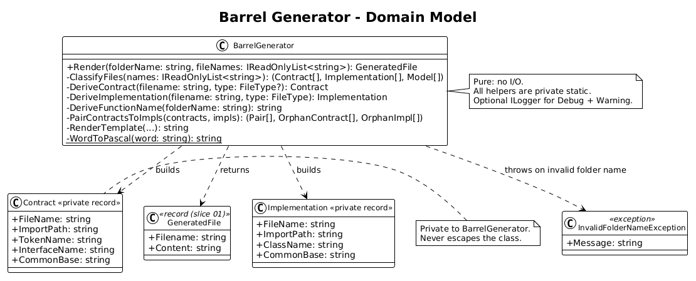
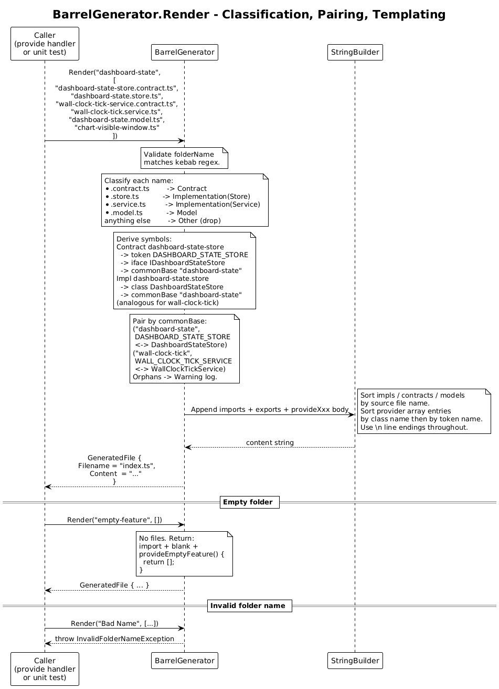

# 07 - Barrel Generator — Detailed Design

**Status:** Complete

## 1. Overview

This slice adds a single new class, `BarrelGenerator`, that converts a folder
name plus a list of file names into the exact bytes of an Angular barrel
`index.ts`. It is a peer of the existing `Generator` (slice 01 / 06): pure
string manipulation, no filesystem, no console, no DI surface beyond an
optional `ILogger<BarrelGenerator>`.

After this slice, calling

```csharp
new BarrelGenerator().Render(
    folderName: "dashboard-state",
    fileNames: new[] {
        "dashboard-state-store.contract.ts",
        "dashboard-state.store.ts",
        "wall-clock-tick-service.contract.ts",
        "wall-clock-tick.service.ts",
        "dashboard-state.model.ts"
    });
```

returns a `GeneratedFile` whose `Filename` is `"index.ts"` and whose `Content`
is the byte-for-byte barrel from §5.

The directory scan and the file write live in slice 08. This slice deliberately
stops at "given a list of names, render the bytes" so it can be tested with no
filesystem at all.

**In scope:**
- New `BarrelGenerator` class with one public method.
- Classification of file names against the recognised patterns (L2-021 — the
  pattern-matching half; the I/O scan itself is slice 08).
- Symbol-name derivation for contracts (L2-022) and implementations (L2-023).
- `provideXxx` function-name derivation from folder name (L2-025).
- Token-to-implementation pairing by common base segment (L2-026).
- Generated barrel structure and ordering (L2-027).
- `provideXxx` function body and ordering (L2-028).
- Determinism — LF endings, single trailing newline, byte-stable output (L2-030).

**Out of scope:**
- `Directory.EnumerateFiles`, the `provide` sub-command, file write, exit
  codes — all in slice 08.
- Updating `Generator` or `NameValidator` — they are reused unchanged.
- Extracting the existing `ToPascalCase` / `SplitWords` helpers into a shared
  class. They remain `internal static` on `Generator` and are called directly
  from `BarrelGenerator` (same assembly).

**Traces to:** L2-021 (classification rules only), L2-022, L2-023, L2-024,
L2-025, L2-026, L2-027, L2-028, L2-030.

## 2. Architecture

### 2.1 Class Diagram



### 2.2 Sequence — `Render`



`BarrelGenerator.Render` is one synchronous call. It classifies, derives,
pairs, and renders, returning a `GeneratedFile`. There are no side effects;
the optional `ILogger` only emits debug/warning messages.

## 3. Component Details

### 3.1 `BarrelGenerator`

**Type:** Concrete, sealed class. Registered as singleton in DI by slice 08.
No interface — there is one implementation today, and "we might swap it later"
is not a reason to add one.

**Public surface:**

```csharp
public sealed class BarrelGenerator(ILogger<BarrelGenerator>? logger = null)
{
    public GeneratedFile Render(string folderName, IReadOnlyList<string> fileNames);
}
```

`folderName` is the final path segment of the target directory (e.g.
`"dashboard-state"`). Slice 08 derives it via
`Path.GetFileName(Path.GetFullPath(target))`.

`fileNames` is the list of file names (no paths) found in the target
directory. Slice 08 sources it via
`Directory.EnumerateFiles(target, "*", SearchOption.TopDirectoryOnly)
.Select(Path.GetFileName)`.

**Returns** a `GeneratedFile` with `Filename = "index.ts"` and the barrel
content. The same `GeneratedFile` record from slice 01 is reused — no new
type.

**Throws** `InvalidFolderNameException` if `folderName` does not match the
kebab-case shape `[a-z][a-z0-9]*(-[a-z0-9]+)*` (validated against the
already-lower-cased input). The CLI maps this to exit code 1 in slice 08.

### 3.2 Pipeline (in order)

1. **Validate folder name** — non-empty, matches the kebab regex. Otherwise
   throw `InvalidFolderNameException`.
2. **Classify each file** — see §3.3. Unknown files are silently dropped.
3. **Derive symbols** — see §3.4 and §3.5.
4. **Pair contracts to implementations** — see §3.6.
5. **Render the template** — see §3.7.
6. Return `new GeneratedFile("index.ts", content)`.

All transformations are private static methods on `BarrelGenerator`. Nothing
is `internal`; tests exercise the class through its public `Render` method.

### 3.3 File classification

Each file name is matched against the suffix patterns below in order. The
first match wins. A file that matches none is silently ignored — this is what
keeps `index.ts`, `*.spec.ts`, `chart-visible-window.ts`, and any other
hand-written file out of the barrel.

| Pattern | Kind | Notes |
|---------|------|-------|
| `*.store.contract.ts` | Contract (type=`Store`) | More specific than `.contract.ts` |
| `*.service.contract.ts` | Contract (type=`Service`) | More specific than `.contract.ts` |
| `*.contract.ts` | Contract (type=`null`) | Catch-all for typeless contracts |
| `*.store.ts` | Implementation (type=`Store`) | Excludes `*.store.spec.ts`, `*.store.test.ts` |
| `*.service.ts` | Implementation (type=`Service`) | Excludes `*.service.spec.ts`, `*.service.test.ts` |
| `*.model.ts` | Model | |
| anything else | Other (ignored) | Includes `index.ts` itself |

Matching is case-sensitive on the suffix. The `.spec.ts` / `.test.ts`
exclusion is implicit: `Path.GetFileName("foo.store.spec.ts")` does not end
with the literal `.store.ts`, so it is classified as Other.

**Why pattern order matters.** A file ending in `.store.contract.ts` matches
both the store-contract and the plain-contract patterns. Taking the first
match preserves the type word so that pairing in §3.6 works against
`event.store.contract.ts` paired with `event.store.ts`.

### 3.4 Contract symbol derivation (L2-022)

For a contract file `<base>.contract.ts`:

1. `baseSeg = filename` minus `.contract.ts`.
2. `words = baseSeg.Split('.', '-')`. Empty segments are impossible because
   the filename has already been split by the suffix.
3. `pascal = string.Concat(words.Select(WordToPascal))` where `WordToPascal`
   uppercases the first ASCII letter and lowercases the rest. (Reuses the
   slice-06 helper logic; see §3.8.)
4. `interfaceName = "I" + pascal` unless `pascal` already starts with `I`
   followed by an uppercase letter, in which case `interfaceName = pascal`
   (matches L2-001 and L2-022 #4).
5. `tokenName = string.Join('_', wordsBare).ToUpperInvariant()` where
   `wordsBare` is `words` with any leading `"I"` (or `"i"`) word stripped.
6. `commonBase` — used for pairing in §3.6:
   - If `words[^1].ToLowerInvariant() ∈ {"store", "service"}`, common base is
     the remaining words joined with `-`, lower-cased.
   - Otherwise common base is all words joined with `-`, lower-cased.
7. `importPath = "./" + filename.Replace(".ts", "")` (e.g.
   `"./dashboard-state-store.contract"`).

Worked examples:

| Filename | Words | PascalCase | Interface | Token | Common base |
|----------|-------|------------|-----------|-------|-------------|
| `event.store.contract.ts` | `[event, store]` | `EventStore` | `IEventStore` | `EVENT_STORE` | `event` |
| `command.service.contract.ts` | `[command, service]` | `CommandService` | `ICommandService` | `COMMAND_SERVICE` | `command` |
| `dashboard-state-store.contract.ts` | `[dashboard, state, store]` | `DashboardStateStore` | `IDashboardStateStore` | `DASHBOARD_STATE_STORE` | `dashboard-state` |
| `user.contract.ts` | `[user]` | `User` | `IUser` | `USER` | `user` |
| `foo-bar-baz.contract.ts` | `[foo, bar, baz]` | `FooBarBaz` | `IFooBarBaz` | `FOO_BAR_BAZ` | `foo-bar-baz` |

### 3.5 Implementation symbol derivation (L2-023)

For an implementation file `<base>.<type>.ts` (where type is `store` or
`service`):

1. `baseSeg = filename` minus `.<type>.ts`.
2. `words = baseSeg.Split('.', '-')`.
3. `pascalBase = string.Concat(words.Select(WordToPascal))`.
4. `className = pascalBase + "Store"` or `pascalBase + "Service"` (from the
   suffix that matched).
5. `commonBase = string.Join('-', words).ToLowerInvariant()`.
6. `importPath = "./" + filename.Replace(".ts", "")`.

Worked examples:

| Filename | Words | Base PascalCase | Class | Common base |
|----------|-------|------------------|-------|-------------|
| `event.store.ts` | `[event]` | `Event` | `EventStore` | `event` |
| `dashboard-state.store.ts` | `[dashboard, state]` | `DashboardState` | `DashboardStateStore` | `dashboard-state` |
| `command.service.ts` | `[command]` | `Command` | `CommandService` | `command` |
| `wall-clock-tick.service.ts` | `[wall, clock, tick]` | `WallClockTick` | `WallClockTickService` | `wall-clock-tick` |

### 3.6 Pairing (L2-026)

After classification and derivation:

1. Build `Dictionary<string, Implementation> implByBase` from the
   implementation list. Key is `common base`. If two implementations share a
   common base (rare, e.g. `event.store.ts` and `event.service.ts`), the
   first in alphabetical order wins; the others land in the unpaired list and
   the logger emits a `Warning`. This is recorded as Open Question 8.1.
2. For each contract: if `implByBase.TryGetValue(contract.commonBase, out
   var impl)`, the contract is paired with `impl`. Otherwise the contract is
   unpaired and the logger emits a `Warning` identifying the orphan token.
3. Implementations not consumed in step 2 are flagged unpaired and logged at
   `Warning`. They still appear as standalone providers — see §3.7.

The pairing examples:

| Contract | Common base | Implementation | Common base | Match? |
|----------|-------------|----------------|-------------|--------|
| `event.store.contract.ts` | `event` | `event.store.ts` | `event` | ✔ |
| `dashboard-state-store.contract.ts` | `dashboard-state` | `dashboard-state.store.ts` | `dashboard-state` | ✔ |
| `wall-clock-tick-service.contract.ts` | `wall-clock-tick` | `wall-clock-tick.service.ts` | `wall-clock-tick` | ✔ |
| `user.contract.ts` | `user` | *(none)* | — | ✘ — orphan token, logged Warning |
| *(none)* | — | `orphan.store.ts` | `orphan` | ✘ — standalone provider, logged Warning |

### 3.7 Template (L2-027, L2-028)

The output is built in a `StringBuilder` with `\n` line endings throughout,
ending in a single trailing `\n`:

```text
import { Provider } from '@angular/core';

<one line per implementation, sorted by source file name>:
export { ClassName } from 'importPath';
<one line per contract, sorted by source file name>:
export { TOKEN_NAME } from 'importPath';
<one line per contract, sorted by source file name>:
export type { IInterfaceName } from 'importPath';
<one line per model, sorted by source file name>:
export type * from 'importPath';

export function provideXxx(): Provider[] {
  return [
    <one line per implementation, sorted by ClassName>:
    ClassName,
    <one line per pair, sorted by token name>:
    { provide: TOKEN_NAME, useExisting: ClassName }
  ];
}
```

Notes:

- The blank line after the imports/exports block separates the re-exports from
  the function declaration. Two-space indentation inside the function body
  matches the slice-06 generated `.contract.ts` indentation style.
- Empty arrays render as `return [];` on a single line — no trailing comma,
  no whitespace between brackets. Achieved by building the body, trimming a
  trailing `,\n`, and emitting `\n  ];` regardless.
- The `export type * from '...'` syntax requires TypeScript 5.0+. The host
  Angular project already targets 5.x; if it doesn't, the build fails loudly
  at the host's `tsc` step rather than silently miscompiling. Recorded as
  Open Question 8.2.
- If there are no implementations and no models and no contracts, the file
  still renders the import line, the blank line, and an empty
  `provideXxx(): Provider[] { return []; }`. This is the radically simple
  outcome: empty barrel for empty folder, no special-case error.

### 3.8 Reuse of slice-06 helpers

`Generator.ToPascalCase(string)` and `Generator.SplitWords(string)` are
already `internal static` (slice 06) and live in the same assembly.
`BarrelGenerator` does not call them, however — its inputs are kebab-case
file-name segments that are already lower-case and already split, so the
`WordToPascal` step is a one-liner:

```csharp
private static string WordToPascal(string word) =>
    word.Length == 0 ? word
    : char.ToUpperInvariant(word[0]) + word[1..].ToLowerInvariant();
```

Keeping this inline avoids a new shared `Naming` class for one extra caller.
If a third caller appears, extract it.

## 4. Data Model

No new public types. Reused from earlier slices:

- `GeneratedFile(Filename, Content)` — slice 01.
- `InvalidNameException` — slice 01 (not used here; we add a peer below).

One new exception:

```csharp
public sealed class InvalidFolderNameException(string folderName)
    : Exception($"Folder name '{folderName}' is not a valid kebab-case identifier.");
```

It does not derive from `IOException` because no I/O has happened yet at the
point it is thrown. Slice 08's CLI handler catches it explicitly and maps to
exit code 1.

Internally, `BarrelGenerator` uses two private records to carry the
classified files through the pipeline:

```csharp
private sealed record Contract(string FileName, string ImportPath, string TokenName, string InterfaceName, string CommonBase);
private sealed record Implementation(string FileName, string ImportPath, string ClassName, string CommonBase);
```

These types are private to the class and never escape it.

## 5. Worked End-to-End Example

**Folder name:** `dashboard-state`

**Files:**
```
dashboard-state-store.contract.ts
dashboard-state.model.ts
dashboard-state.store.ts
wall-clock-tick-service.contract.ts
wall-clock-tick.service.ts
chart-visible-window.ts                ← ignored (no recognised pattern)
index.ts                               ← ignored (no recognised pattern)
```

**Classified:**

| File | Kind | Class / Token / Interface | Common base |
|------|------|---------------------------|-------------|
| `dashboard-state-store.contract.ts` | Contract | `DASHBOARD_STATE_STORE` / `IDashboardStateStore` | `dashboard-state` |
| `wall-clock-tick-service.contract.ts` | Contract | `WALL_CLOCK_TICK_SERVICE` / `IWallClockTickService` | `wall-clock-tick` |
| `dashboard-state.store.ts` | Implementation | `DashboardStateStore` | `dashboard-state` |
| `wall-clock-tick.service.ts` | Implementation | `WallClockTickService` | `wall-clock-tick` |
| `dashboard-state.model.ts` | Model | — | — |

**Pairing:** both contracts pair with their implementations. No orphans.

**Output (`index.ts`):**

```typescript
import { Provider } from '@angular/core';

export { DashboardStateStore } from './dashboard-state.store';
export { WallClockTickService } from './wall-clock-tick.service';
export { DASHBOARD_STATE_STORE } from './dashboard-state-store.contract';
export { WALL_CLOCK_TICK_SERVICE } from './wall-clock-tick-service.contract';
export type { IDashboardStateStore } from './dashboard-state-store.contract';
export type { IWallClockTickService } from './wall-clock-tick-service.contract';
export type * from './dashboard-state.model';

export function provideDashboardState(): Provider[] {
  return [
    DashboardStateStore,
    WallClockTickService,
    { provide: DASHBOARD_STATE_STORE, useExisting: DashboardStateStore },
    { provide: WALL_CLOCK_TICK_SERVICE, useExisting: WallClockTickService }
  ];
}
```

## 6. ATDD Test Plan for This Slice

All tests are unit tests against `BarrelGenerator`. No file I/O, no console,
no host. Each test file carries a `// Traces to: L2-...` header.

The fixture builds an instance of `BarrelGenerator` with `NullLogger` and
asserts on the returned `GeneratedFile`'s `Content`.

1. `Render_FolderWithSingleStorePair_ProducesPairedBarrel` — L2-022 #1,
   L2-023 #1, L2-026 #1, L2-027 #1, L2-028 #1.
2. `Render_FolderWithSingleServicePair_ProducesPairedBarrel` — L2-022 #2,
   L2-023 #3, L2-026 #2.
3. `Render_DottedKebabContract_DerivesCorrectSymbols` — L2-022 #3 (input
   `dashboard-state-store.contract.ts` paired with
   `dashboard-state.store.ts`).
4. `Render_FlatContract_DerivesIPrefixedInterface` — L2-022 #4 (input
   `user.contract.ts`, no pair, expect orphan token warning and no
   `useExisting` line).
5. `Render_ModelFile_AddsTypeStarReexport` — L2-024 #1.
6. `Render_NoModelFiles_OmitsModelReexports` — L2-024 #3.
7. `Render_FolderName_DashboardState_ProducesProvideDashboardState` —
   L2-025 #1.
8. `Render_FolderName_UserAccountManagement_ProducesProvideUserAccountManagement`
   — L2-025 #3.
9. `Render_EmptyFolderName_ThrowsInvalidFolderNameException` — L2-025 #4.
10. `Render_UnpairedContract_OmitsTokenRegistrationAndLogsWarning` —
    L2-026 #3.
11. `Render_UnpairedImplementation_AddsClassWithoutUseExistingAndLogsWarning`
    — L2-026 #4.
12. `Render_MultiplePairs_OrderedAlphabeticallyByClassThenByToken` —
    L2-027 #2, L2-028 #1.
13. `Render_FolderWithoutContracts_GeneratesProviderArrayWithoutTokenRegistrations`
    — L2-028 #2.
14. `Render_EmptyFolder_GeneratesEmptyProviderArray` — L2-028 #3.
15. `Render_TwoCalls_ProduceIdenticalBytes` — L2-030 #1.
16. `Render_OutputUsesLfLineEndingsAndSingleTrailingNewline` — L2-027 #3,
    L2-030 #3.
17. `Render_UnknownFiles_IgnoredSilently` — L2-021 #4 plus integration
    cover for `chart-visible-window.ts` and `*.store.spec.ts`.

The `// Traces to:` header on each test file lists the L2 IDs above.

## 7. Security Considerations

- **Pure string manipulation.** No filesystem, network, or environment
  access in this slice. The set of bytes that can reach the template comes
  from the file names (lower-cased ASCII letters, digits, and `-`/`.`)
  and the folder name (the kebab regex already rejects anything else).
- **No code interpretation.** File names are concatenated into TypeScript
  identifiers via deterministic transforms; no `eval`, no template literals
  that could be broken by `${...}` injection (the template uses single
  quotes for string literals exclusively).
- **No log leakage.** The logger emits the file names and derived symbol
  names at `Debug` only. No content body, no environment variables, no
  paths beyond the bare file name.

## 8. Open Questions

### 8.1 Two implementations sharing one common base

If a folder contains both `event.store.ts` and `event.service.ts`, both have
common base `event`. The current design takes the first alphabetically as
the pair candidate and warns on the rest. In real projects the case is
unusual (one would normally name them `event-source.service.ts` and
`event.store.ts`, giving distinct bases). If the case shows up in practice,
refine the pairing rule to require the contract's trailing type word to
match the implementation's type suffix. That is a one-method change and not
worth pre-emptively.

### 8.2 `export type *` and the host's TypeScript version

`export type * from '...'` is TypeScript 5.0+. Angular 16+ projects already
require 5.x. If a future host uses an older compiler, the barrel will fail
to compile with a clear error pointing at the line in `index.ts`. Treat it
as "loudly broken in an obviously-fixable way" rather than designing around
hypothetical hosts.

### 8.3 Idempotency on existing barrels

If the user runs `tokenq provide` and then again with `--force`, the second
run produces the same bytes (L2-030 #1). The user's manual additions inside
the generated `index.ts` (e.g. an extra `export *` for a non-conventional
file) are overwritten. There is no preservation block. Document this in the
README of the tool itself when slice 08 ships; users who need to extend the
barrel manually can either rename their custom file to a recognised pattern
or maintain a separate file (e.g. `index.extra.ts`) that re-exports from
`./index`.

### 8.4 Bare `*.contract.ts` (typeless contract)

A file named `user.contract.ts` (no `.store.` or `.service.` segment) is
recognised as a contract with `type=null`. The interface name is `IUser`
and the token is `USER`. Such contracts cannot pair with any
implementation file (implementations always have a type suffix), so they
are emitted as orphan tokens and warned. This is the literal reading of
L2-026; if requirements ever ask for typeless contracts to pair with a
hypothetical `user.ts` file, that is a new requirement, not a refinement
here.
