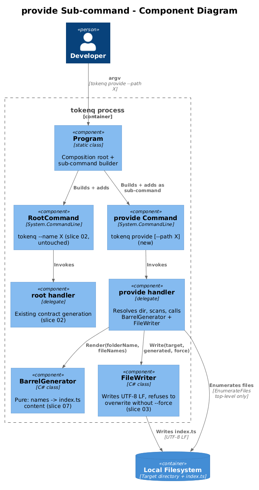
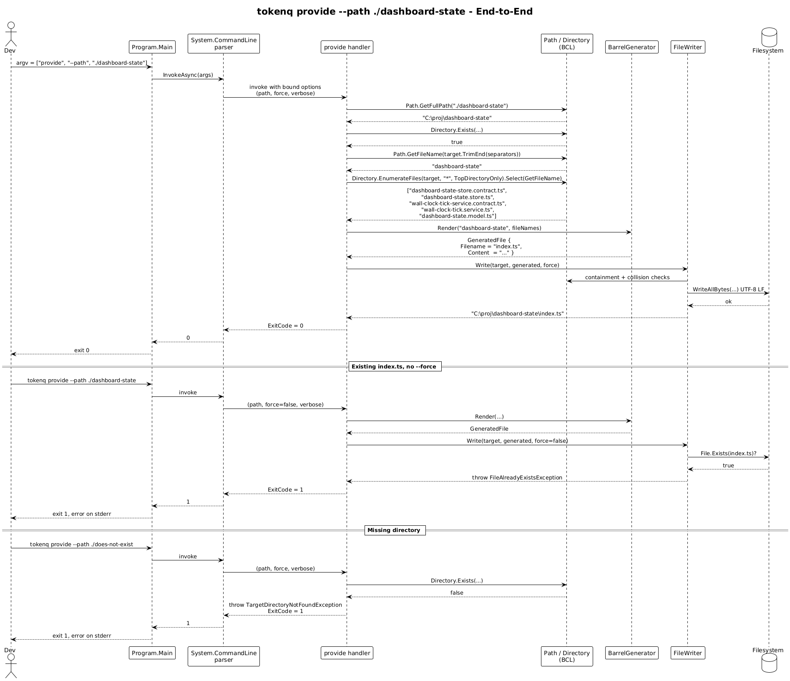

# 08 - `provide` Sub-command — Detailed Design

**Status:** Accepted

## 1. Overview

This slice wires slice 07's `BarrelGenerator` into the CLI by adding a single
sub-command, `provide`. The new sub-command lives alongside the existing
root-level contract generator — `tokenq --name X` keeps working unchanged.

After this slice:

```
tokenq provide                                # writes index.ts in cwd
tokenq provide --path ./src/app/dashboard      # writes index.ts there
tokenq provide --path ./src/app/dashboard -f   # overwrites if present
tokenq provide --help                          # shows the sub-command's options
tokenq --help                                  # lists `provide` as a sub-command
```

The handler is the only place where directory enumeration, the barrel
generator, and the file writer meet. It is ~30 lines.

**In scope:**
- A new `Command provide` registered on the existing `RootCommand`.
- `--path` (alias `-p`), `--force` (alias `-f`), `--verbose` (alias `-v`)
  options on the sub-command.
- Target directory resolution and validation (L2-020).
- Non-recursive directory enumeration (L2-021 — the I/O half).
- Folder-name extraction from the resolved path.
- Calling `BarrelGenerator.Render`.
- Calling the existing `FileWriter.Write` with `index.ts`.
- Mapping the new exception types to the existing exit codes.

**Out of scope:**
- Generating barrel content — slice 07.
- Generating contract files — slice 01 / 06 (untouched).
- Logging configuration — already in slice 04.
- NuGet packaging — already in slice 05; the sub-command is in the same
  assembly and ships in the same package automatically.

**Traces to:** L2-019, L2-020, L2-021 (the I/O half), L2-029, L2-030
(end-to-end).

## 2. Architecture

### 2.1 Component View



There are still only two production C# files that change for this slice:
`Program.cs` (adds the sub-command and its handler) and the existing
`FileWriter` (no behavioural change — already accepts arbitrary
`GeneratedFile.Filename`). The new `BarrelGenerator` lives in its own file
from slice 07.

### 2.2 Sequence — `tokenq provide --path ./dashboard`



## 3. Component Details

### 3.1 `Program` (extended)

Slice 02 introduced one `RootCommand` with a single handler. This slice
adds a sibling `Command("provide")` on the same root. The DI registration
adds one new line:

```csharp
services.AddSingleton<BarrelGenerator>();
```

The new command and its handler are built in a private helper:

```csharp
private static Command BuildProvideCommand(IServiceProvider provider)
{
    var pathOption    = new Option<string?>("--path",    "Target directory");                pathOption.AddAlias("-p");
    var forceOption   = new Option<bool>(   "--force",   "Overwrite existing index.ts");      forceOption.AddAlias("-f");
    var verboseOption = new Option<bool>(   "--verbose", "Enable debug logging");             verboseOption.AddAlias("-v");

    var cmd = new Command("provide", "Generate an Angular barrel index.ts for a folder")
    {
        pathOption, forceOption, verboseOption,
    };

    cmd.SetHandler(context =>
    {
        var path    = context.ParseResult.GetValueForOption(pathOption);
        var force   = context.ParseResult.GetValueForOption(forceOption);
        var verbose = context.ParseResult.GetValueForOption(verboseOption);
        var logger  = provider.GetRequiredService<ILoggerFactory>().CreateLogger("TokenQ");
        try
        {
            var (target, folderName, fileNames) = ResolveAndScan(path);
            var generated = provider.GetRequiredService<BarrelGenerator>()
                                    .Render(folderName, fileNames);
            var written = provider.GetRequiredService<FileWriter>()
                                  .Write(target, generated, force);
            logger.LogInformation("Wrote {Path}", written);
        }
        catch (InvalidFolderNameException ex)        { LogFailure(logger, ex, verbose); context.ExitCode = 1; }
        catch (TargetDirectoryNotFoundException ex)  { LogFailure(logger, ex, verbose); context.ExitCode = 1; }
        catch (Exception ex) when (ex is IOException or UnauthorizedAccessException)
                                                     { LogFailure(logger, ex, verbose); context.ExitCode = 1; }
        catch (Exception ex)                         { LogFailure(logger, ex, verbose); context.ExitCode = 2; }
    });

    return cmd;
}
```

`Main` changes to:

```csharp
var root = BuildRootCommand(provider);
root.AddCommand(BuildProvideCommand(provider));
return root.InvokeAsync(args).GetAwaiter().GetResult();
```

The existing `BuildRootCommand` is untouched. Its exception handling is
copied (not extracted) into `BuildProvideCommand`. Two ten-line `catch`
blocks are simpler than a shared helper for two callers.

### 3.2 `ResolveAndScan` — the I/O step

A single private static method on `Program`:

```csharp
private static (string Target, string FolderName, IReadOnlyList<string> FileNames)
    ResolveAndScan(string? pathOption)
{
    string target;
    try
    {
        target = string.IsNullOrEmpty(pathOption)
            ? Directory.GetCurrentDirectory()
            : Path.GetFullPath(pathOption);
    }
    catch (Exception ex) when (ex is ArgumentException or NotSupportedException)
    {
        throw new InvalidOutputPathException(pathOption ?? string.Empty, ex);
    }

    if (System.IO.File.Exists(target) && !Directory.Exists(target))
        throw new OutputPathIsFileException(target);
    if (!Directory.Exists(target))
        throw new TargetDirectoryNotFoundException(target);

    var folderName = Path.GetFileName(target.TrimEnd(Path.DirectorySeparatorChar,
                                                     Path.AltDirectorySeparatorChar));
    if (string.IsNullOrEmpty(folderName))
        throw new InvalidFolderNameException(target);

    var fileNames = Directory
        .EnumerateFiles(target, "*", SearchOption.TopDirectoryOnly)
        .Select(Path.GetFileName)
        .Where(n => !string.IsNullOrEmpty(n))
        .Cast<string>()
        .ToArray();

    return (target, folderName, fileNames);
}
```

Why all in one method and not extracted to a `DirectoryScanner` class?
Because there is one caller (the provide handler) and the work is six BCL
calls. A class would be ceremony.

The method reuses two of `FileWriter`'s exception types
(`InvalidOutputPathException`, `OutputPathIsFileException`) so the user-facing
error messages stay consistent across the two commands.

### 3.3 `FileWriter` — reused unchanged

`FileWriter.Write(target, generated, force)` is the same call shape as the
root command's handler. `generated.Filename` is `"index.ts"`, `target` is
the resolved directory, `force` controls overwrite. `FileWriter` already:

- normalises and contains the path (L2-008),
- creates the directory if it does not exist (L2-004 #3 — note that the
  provide handler has already verified the directory *does* exist via
  `Directory.Exists`, so this branch is a no-op here),
- refuses to overwrite without `--force` (L2-006 — same logic satisfies
  L2-029),
- writes UTF-8 LF (L2-009 — same logic satisfies L2-030).

No changes to `FileWriter` are required.

### 3.4 New exception types

Two new exceptions, both in `Program.cs` next to the handler (one place
to find them; will be moved to their own file only if a third caller
appears):

```csharp
public sealed class TargetDirectoryNotFoundException(string path)
    : IOException($"Target directory not found: {path}");

public sealed class InvalidFolderNameException(string path)
    : Exception($"Cannot derive a valid function name from directory: {path}");
```

`TargetDirectoryNotFoundException` derives from `IOException` so the
existing slice-04 logging treats it like other I/O failures.
`InvalidFolderNameException` is plain `Exception` because it represents a
naming-contract failure (the same reason the slice-01/06
`InvalidNameException` is plain `Exception`); the handler catches it
explicitly.

## 4. Data Model

No new persistent or in-process records. The handler builds a one-shot
tuple `(target, folderName, fileNames)` inline rather than declaring a
record, exactly as slice 02 builds its `CommandRequest` inline.

## 5. Key Workflows

### 5.1 First-time `tokenq provide` in a folder

`tokenq provide --path ./src/app/dashboard` →
- `ResolveAndScan` returns `("…/dashboard", "dashboard", ["dashboard-state.store.ts", …])`.
- `BarrelGenerator.Render("dashboard", names)` returns
  `GeneratedFile { Filename = "index.ts", Content = "…" }`.
- `FileWriter.Write("…/dashboard", generated, force: false)` writes
  `…/dashboard/index.ts`.
- Logger emits `Information: Wrote …/dashboard/index.ts`. Exit `0`.

### 5.2 Re-run with `--force`

Same command with `-f`. `FileWriter` sees the existing `index.ts`, sees
`force = true`, overwrites. Output is byte-identical to the previous run
(L2-030 #1).

### 5.3 Re-run without `--force`

Same command without `-f`. `FileWriter` throws
`FileAlreadyExistsException`. Handler maps to exit `1`, error on stderr,
file unchanged.

### 5.4 Missing directory

`tokenq provide --path ./does-not-exist` → `ResolveAndScan` throws
`TargetDirectoryNotFoundException`. Exit `1`.

### 5.5 Path is a file

`tokenq provide --path ./README.md` → `ResolveAndScan` throws
`OutputPathIsFileException`. Exit `1`.

### 5.6 No `--path`

`tokenq provide` → target is the current working directory. The folder
name is the cwd's final segment (e.g. `dashboard-state` if cwd is
`…/dashboard-state`). If cwd is a drive root (rare, `C:\`),
`Path.GetFileName` returns empty and `InvalidFolderNameException` is
thrown. Exit `1`.

### 5.7 Empty folder

`tokenq provide --path ./empty` → `ResolveAndScan` returns an empty
file-name list. `BarrelGenerator.Render` returns the minimal barrel
(import + empty `provideEmpty()`). The file is written. Exit `0`.

## 6. CLI Contract

The full grammar after this slice is:

```
tokenq --name <interface-name> [--output <dir>] [--force] [--verbose]      # generate contract (existing)
tokenq provide [--path <dir>] [--force] [--verbose]                        # generate barrel (new)
tokenq --help | --version                                                  # global
tokenq provide --help                                                      # sub-command help
```

Exit codes (L2-011, unchanged): `0` success, `1` user/input error, `2`
unexpected internal error.

## 7. ATDD Test Plan for This Slice

Tests live in `tests/TokenQ.Tests/`. Most are integration tests using
`Path.GetTempPath() + Guid.NewGuid()` for isolation, exactly like
slice 03.

1. `Provide_FolderWithStorePair_WritesExpectedIndexTs` — L2-019 #1, end-to-
   end happy path; reads back `index.ts` and asserts byte equality with
   the slice-07 worked example.
2. `Provide_NoPath_UsesCurrentWorkingDirectory` — L2-019 #2 (sets cwd to
   the temp dir for the test).
3. `Provide_WithPath_UsesSuppliedPath` — L2-019 #3.
4. `Provide_HelpFlag_ListsOptionsAndReturnsZero` — L2-019 #1 (`provide
   --help`).
5. `Provide_RootHelp_ListsProvideAsSubcommand` — L2-019 #4 (`tokenq
   --help`).
6. `Provide_NonexistentDirectory_ReturnsOneAndWritesError` — L2-020 #1.
7. `Provide_PathIsFile_ReturnsOne` — L2-020 #2.
8. `Provide_TraversalSegments_ResolvedAndUsed` — L2-020 #3.
9. `Provide_EmptyFolder_WritesEmptyBarrel` — happy path with no
   recognisable files; asserts `provideXxx(): Provider[] { return []; }`.
10. `Provide_IgnoresUnknownFilesAndSubdirectories` — L2-021 #1, #2, #4.
11. `Provide_StoreSpecTsIgnored` — L2-023 #6 (creates `foo.store.spec.ts`
    in the temp dir, verifies it does not appear in the barrel).
12. `Provide_ExistingIndexTsWithoutForce_ReturnsOneAndLeavesFileUnchanged` —
    L2-029 #1.
13. `Provide_ExistingIndexTsWithForce_Replaces` — L2-029 #2.
14. `Provide_TwoRunsWithForce_ProduceIdenticalBytes` — L2-030 #1 end-to-end.
15. `Main_WithoutSubcommand_GenerateContractStillWorks` — regression for
    the existing root command (`tokenq --name IFoo`) so we know slice 02
    survived.

Each test file carries the `// Traces to: L2-...` header.

## 8. Security Considerations

- **Path traversal.** Defended exactly as in slice 03 — `Path.GetFullPath`
  resolves `..` segments, then `FileWriter` verifies containment. The
  enumeration uses `SearchOption.TopDirectoryOnly`, so a malicious
  symbolic link inside the directory cannot recurse.
- **File-name interpretation.** File names are passed through
  `Path.GetFileName` (which strips any directory component) and then to
  `BarrelGenerator`, which only string-manipulates them. No file is read
  or executed by the tool — only its name is consumed.
- **Permission errors.** `Directory.EnumerateFiles` on an unreadable
  directory throws `UnauthorizedAccessException`, which the existing
  catch arm in `BuildProvideCommand` maps to exit code 1 and the error
  message redaction from slice 04 still applies.
- **No log leakage.** The handler logs the resolved target directory and
  the written file path at `Information`, plus debug detail at `Debug`.
  No file content, no environment variables.

## 9. Open Questions

### 9.1 Should the existing root command become a sub-command?

For symmetry, a future change might rename the root behaviour to
`tokenq generate --name X` and treat the bare root command as just
`--help`. That is a breaking change for installed users; not in scope
here. The current shape (root command does contract generation, `provide`
is a sibling sub-command) is the minimum-risk addition.

### 9.2 Where do `BarrelGenerator` and `FileWriter` register?

In `Main`:

```csharp
services.AddSingleton<Generator>();
services.AddSingleton<BarrelGenerator>();   // new
services.AddSingleton<FileWriter>();
```

Singleton matches the rest of the tool. They are stateless and short-lived
(one CLI invocation).

### 9.3 Multiple `--path` runs in a script

If a build script needs to regenerate barrels for many folders, the user
runs `tokenq provide --path …` once per folder. There is no
`--path-pattern` or recursive mode. Adding one would be speculative;
shell `for` loops solve it today. Revisit only if the cold-start cost
of N invocations becomes a real complaint (the slice-05 budget says
< 2 s per invocation, so N folders take ~2N s — usually fine).

### 9.4 Output to stdout

For the contract generator, slice 02 considered "print to stdout" as a
debug aid. The provide command does not have an equivalent. If a user
wants a dry run, they can `--verbose` to see the derivation log lines and
add `--force` only when they're satisfied. Adding a `--dry-run` flag
later is one option in the handler; not now.
